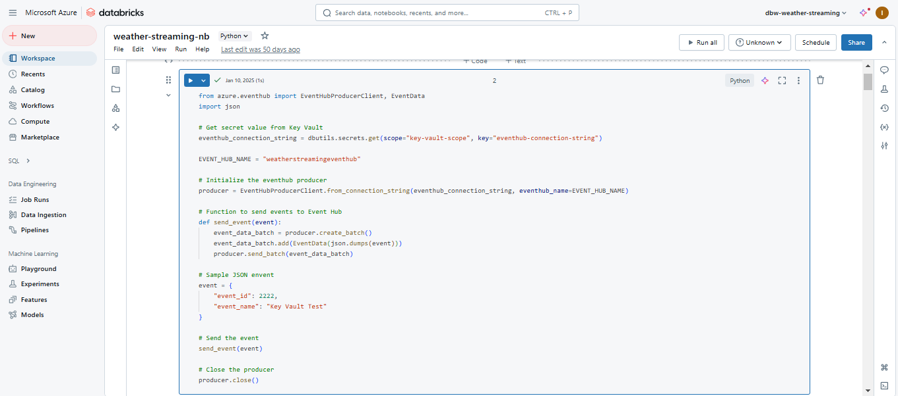
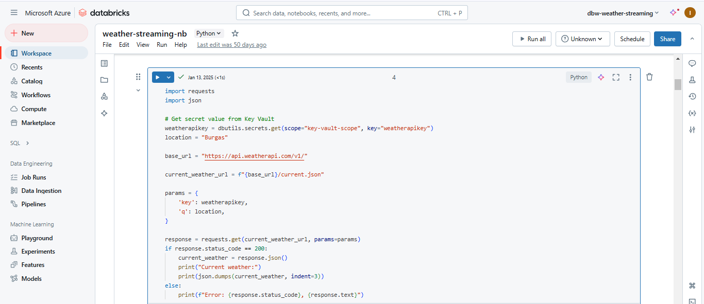
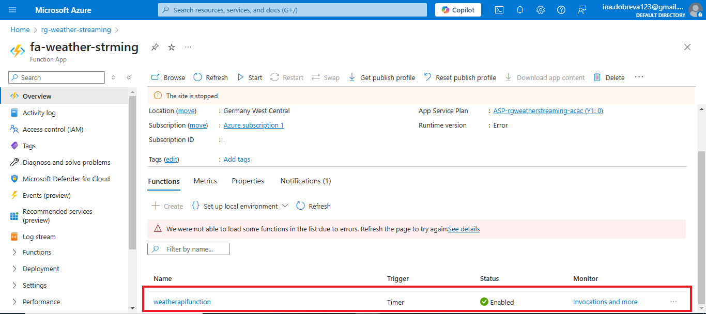
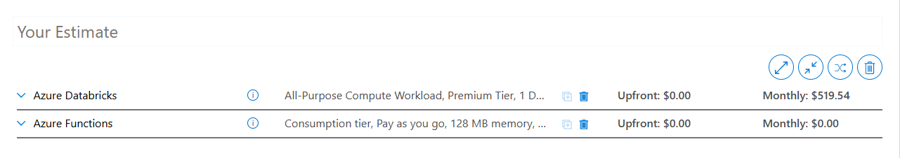
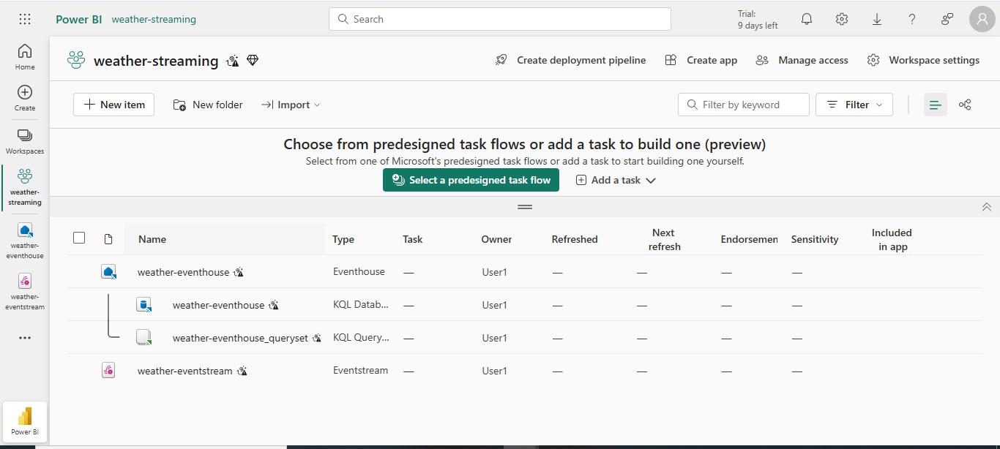
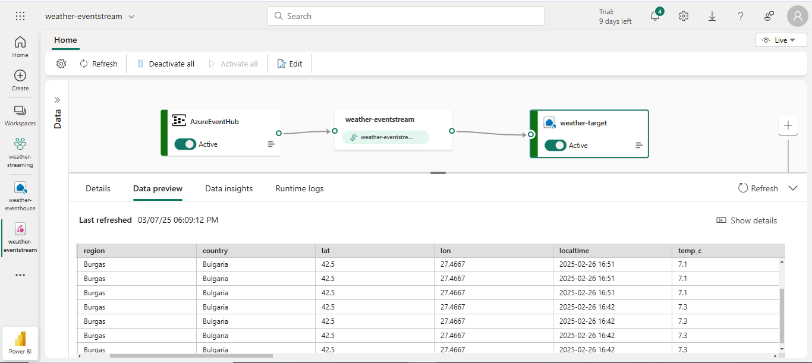
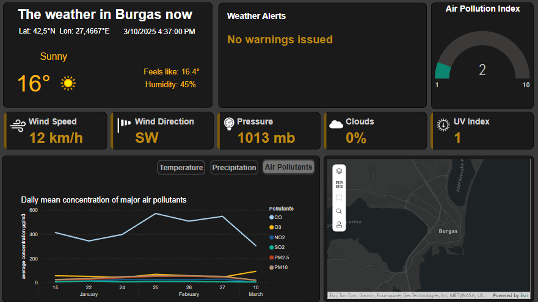

# azure-realtime-weather-pipeline
An end-to-end, real-time weather analytics pipeline on Azure and Microsoft Fabric

## Overview
This project demonstrates an end-to-end real-time data engineering solution using Azure services and Microsoft Fabric to continuously ingest, process, store, and visualize weather data. It begins by pulling data from a free Weather API, then uses Azure Databricks and Azure Functions for data ingestion into Azure Event Hub. From there, Microsoft Fabric’s real-time intelligence features (Event Stream and Kusto DB) manage the streaming and storage, keeping the Power BI dashboard continuously up-to-date. The project also covers secure credential handling with Azure Key Vault.

## Project Technologies
- Azure
  - Azure Databricks
  - Azure Functions
  - Azure Event Hub
  - Azure Key Vault
- Microsoft Fabric
  - Event Stream
  - KQL DB (Kusto DB)
- Power BI

## Development
### Initial Setup
In this first stage, the environment was fully set up to support the real-time weather data pipeline. The key steps included:

- Configuring the Weather API: Signed up for the Weather API, verified the account, and retrieved the API key.
- Creating a Resource Group: Set up a dedicated resource group to organize all project components.
- Deploying Core Azure Services:
  - Azure Databricks Workspace: Created for data ingestion.
  - Azure Functions App: Set up for serverless data ingestion.
  - Azure Event Hub: Provisioned to manage streaming data.
  - Azure Key Vault: Established to securely store sensitive information, including the Weather API key.

 ### Data Ingestion
 In this stage I explored 2 different approaches for data ingestion - **Azure Databricks** and **Azure Functions**. I analyzed their trade-offs carefully to make a reasoned decision for the final project implementation.

#### Azure Databricks  
The data ingestion pipeline was built and tested incrementally. The steps included:  
1. Initialized a cluster  
2. Installed **azure-eventhub** on the cluster - an external Python library, not originally provided by Databricks, to enable integration with the Event Hub  
3. Tested the connection between **Databricks** and **Event Hub** by sending simple JSON test events  
   - monitored the received test events by using the Data Explorer feature in Event Hub  
   - for security purposes, replaced the plain text Event Hub Connection String. To achieve this:  
     - created **Databricks Secret Scope** - to refer and access secrets from the **Azure Key Vault**  
     - via Azure Key Vault assigned Databricks the role **"Key Vault Secret User"** (i.e. gave Databricks read permission and fixed the initial "Permission denied" error)  
        ```python
        eventhub_connection_string = dbutils.secrets.get(scope="key-vault-scope", key="eventhub-connection-string")
        ```
           
4. Tested the connection between **Databricks** and **WeatherAPI**
   - Got the secret API key through the **Databricks Secret Scope**
   - Set up the required parameters by the Weather API documentation
                  
5. Integrating Weather API, Databricks, and Event Hub  
  In the final step, the pipeline connects all three components as follows:
   - Weather API integration
     - A comprehensive script in Azure Databricks retrieves weather data (current conditions, forecasts, alerts) from the Weather API
     - The API responses are processed and flattened into a structured JSON format
   - Databricks Streaming Setup
     Simulated continuous ingestion by using **Spark Structured Streaming** since the Weather API itself isn’t a native streaming source
     - Created a dummy stream that serves as a trigger to periodically execute the processing logic
       ```python
       streaming_df = spark.readStream.format("rate").option("rowsPerSecond", 1).load()
       ```
     - Used **Micro-Batch Processing** with **foreachBatch**  
       **Spark Structured Streaming** processes incoming data in micro-batches where each batch is processed by custom logic
       ```python
       query = streaming_df.writeStream.foreachBatch(process_batch).start()
       ```
     - Timer mechanism to fetch data every 30 seconds  
       Despite a micro-batch is triggered every second, querying the Weather API that frequently is inefficient and unnecessary. To manage this, the **process_batch** function includes a timer check.
        ```python
        def process_batch(batch_df, batch_id):
          global last_sent_time
          try:
              # Get current time
              current_time = datetime.now()
              
              # Check if X seconds have passed since last event was sent
              if (current_time - last_sent_time).total_seconds() >= 30:
                # Fetch weather data
                weather_data = fetch_weather_data()
        
                # Send the weather data 
                send_event(weather_data)
        
                # Update last sent time
                last_sent_time = current_time
                print(f"Event sent at {last_sent_time}")
        
          except Exception as e:
              print(f"Error sending events {batch_id}: {e}")
              raise e 
        ```  
       
 #### Azure Function App  
The key steps in the development of this alternative approach include:  
1. Setting up VS Code to build the data ingestion function on my local machine  
   - Installed the **Azure Functions extension** to enable creating and managing function projects  
   - Linked local development with cloud resources by signing in to my Azure subscription from VS Code  
2. Creating the Function Project  
   - Selected Python and **Time Trigger with a CRON expression** to run every 30 seconds  
   - Let VS Code generate the starter template  
3. Adapting the data ingestion code from Databricks  
   - Removed the Spark-specific components (e.g., Spark Structured Streaming)  
   - Replaced the Databricks secret scope access with **Managed Identity** and assigned appropriate roles  
     - **"Azure Event Hub Data Sender"** role for Event Hub access  
     - **"Key Vault Secret User"** role for the Key Vault  
4. Deployment and testing  
   - Used the Azure Functions extension for VS Code to deploy the function to Azure  
   - Verified the function is correctly deployed and events are successfully sent to the Event Hub every 30 seconds  
   
 

#### Cost Analysis and Architectural Decision
A careful evaluation of cost and performance factors led to the decision to proceed with Azure Functions for data ingestion instead of Azure Databricks. Here is the analysis that influenced this decision:
1. Cost Analysis (based on [Azure pricing calculator estimation](/cost-analysis))
   - Azure Databricks
     - estimated to about **$500/month** (based on the region, workload, pricing tier and instance type)
   - Azure Functions
     - Azure Functions under the **consumption plan** offer **1 million free executions** per month
     - for the given use case (an API call every 30 seconds), Azure Functions generate little to no cost compared to Databricks  
 
2. Performace consideration  
   The project doesn't involve any Big Data workload (e.g., aggregating millions of data points, complex transformations). Fetching weather data via an API and sending it to the Event Hub in this pipeline can be considered as simple tasks.
   - Azure Databricks
       - more suitable for heavy data transformation that is not required here
       - we have to create and maintain the infrastructure, so if any issues occur, we have the responsibility to fix them
   - Azure Functions
       - being serverless, offer quick, efficient execution without the overhead of having to manage infrastructure on our side

### Event Processing and Data Loading
In this stage, **Microsoft Fabric** served as the platform for processing the streaming events from Azure Event Hub and loading them into a **KQL database** for real-time analysis and reporting. 
1. Workspace and **Eventhouse** creation
   - Created a dedicated workspace (e.g., "weather-streaming") in **Fabric** for project resources
   - Within this workspace, created an **Eventhouse** resource which automatically provisions a **KQL database**
  
2. Creating and configuring the **Event Stream** pipeline
   - Source Setup (Event Hub)  
       - Connected the Event Hub to the Event Stream by creating new **Shared Access Policy** connection credentials
       - Selected the default consumer group and set the data format to JSON
   - Target Setup (Eventhouse)
       - Selected the Eventhouse as the target destination for the eventstream pipeline
       - Chose the associated KQL database and created a new destination table (weathertable)
       - Set the input data format to JSON and selected "event processing before injection" to auto-create the table
3. Publishing and verifying the pipeline
   - Published the Eventstream pipeline, which continuously transfers weather data from the Event Hub to the KQL database
   - Verified the correct data ingestion in the KQL DB by checking data previews
   

### Reporting & Visualization
The last development phase leverages **Power BI** to transform the streaming weather data into an interactive, real-time dashboard. Power BI Desktop was the primary tool here since it offers more flexibility than the online version. The main development steps include:
1. Establishing the Data Connection with Power BI Desktop
   - Signed in with my Azure account and provided the necessary details (database name, table name, etc.) to connect Power BI to the KQL database
3. Dashboard development
   - Used various visuals to display the latest weather metrics
   - Enhanced the data using **DAX**
4. Publishing and Configuring the Report
   - Uploaded the dashboard to the Power BI service with Fabric
   - Configured scheduled refresh settings to ensure the report continuously reflects the latest data
   


 
  


    
         


